# LocalLens

A Django-based civic engagement platform that enables citizens to report, track, and collaborate on local community issues. LocalLens bridges the gap between residents and authorities by providing a transparent system for issue reporting and resolution.

## Screenshots

### Login
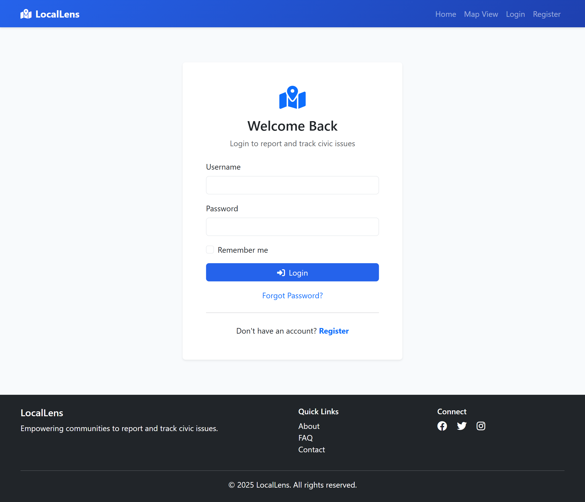

### Register
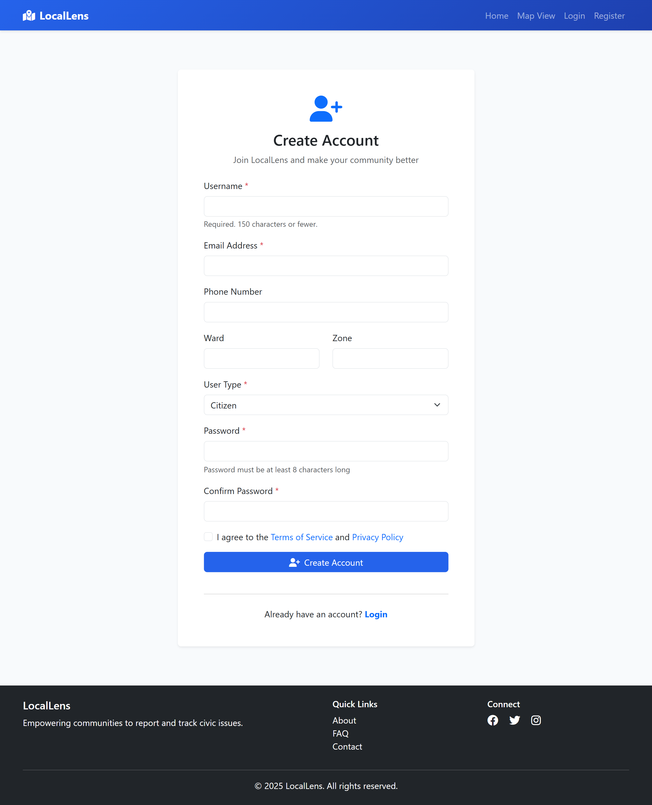

### Home Page
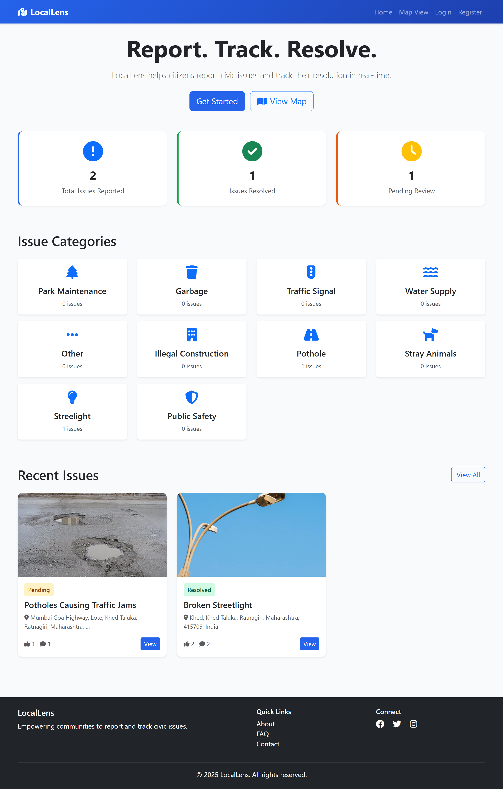

### Report Issue


### Issue Detail
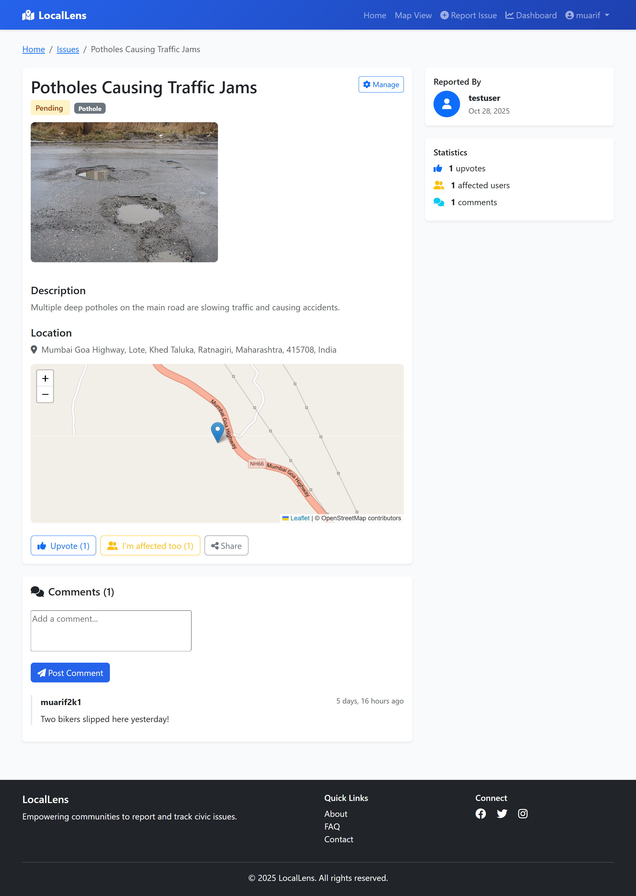

### Map View
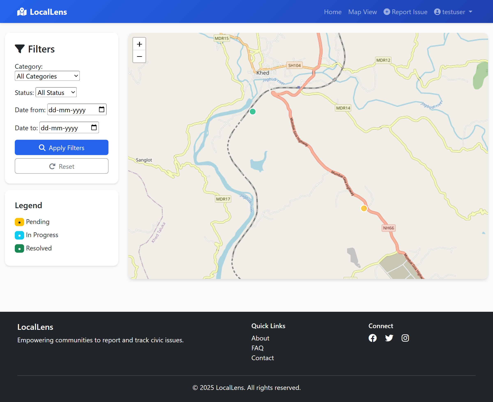

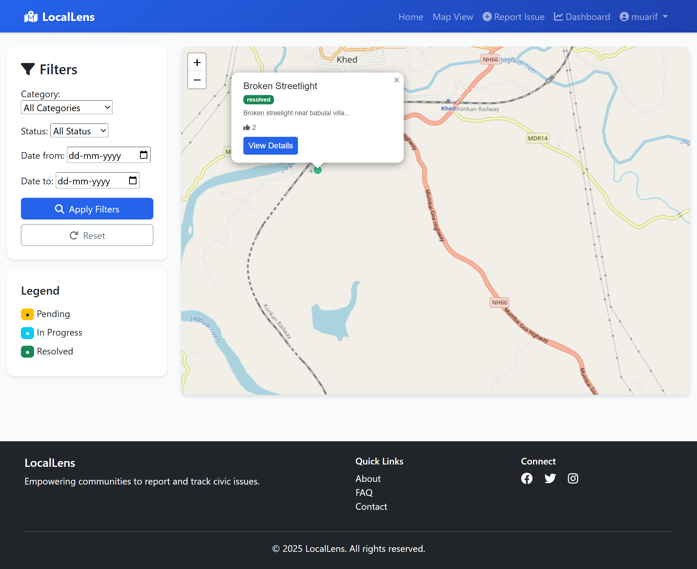

### My Profile
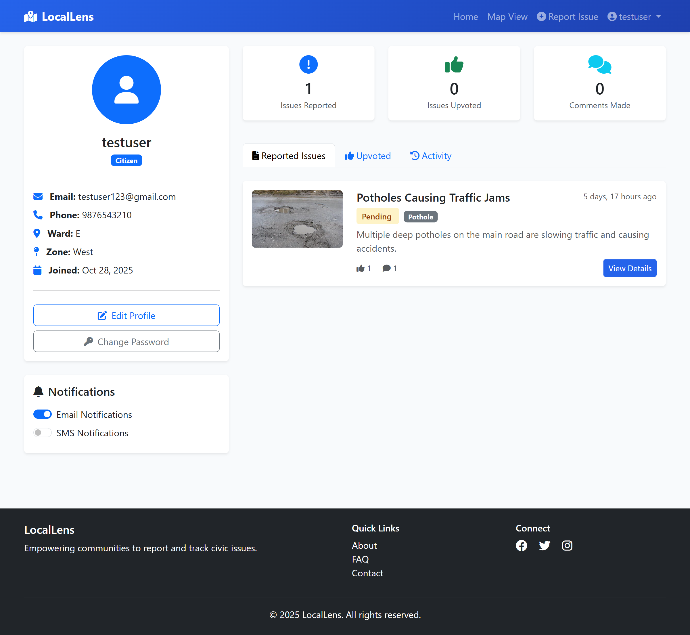

### Edit Profile
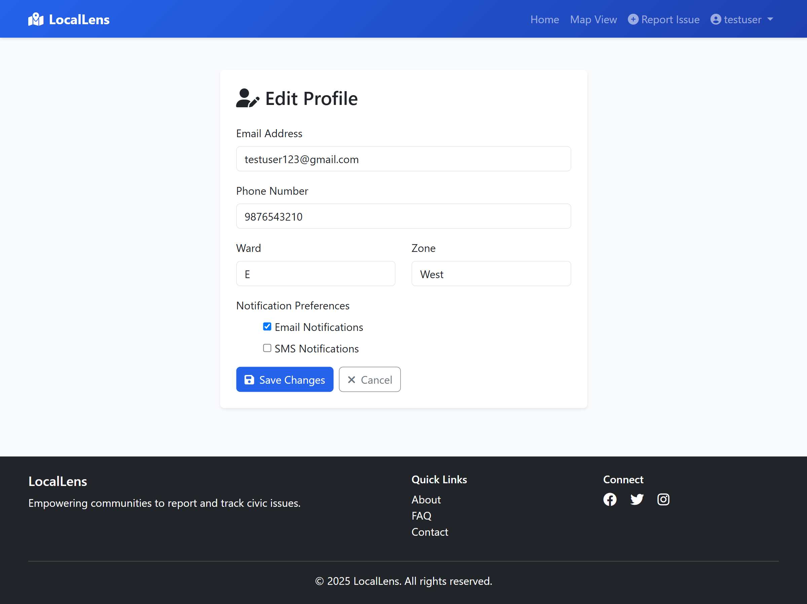

### My Issues
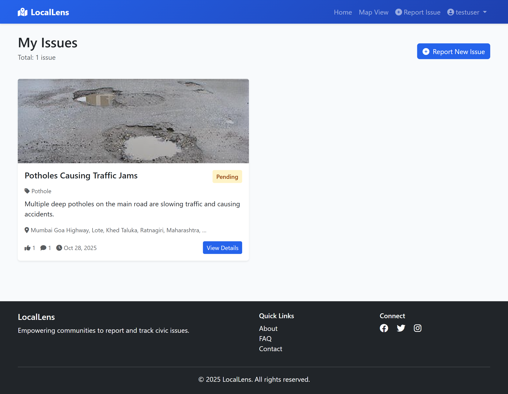

### Authority Dashboard
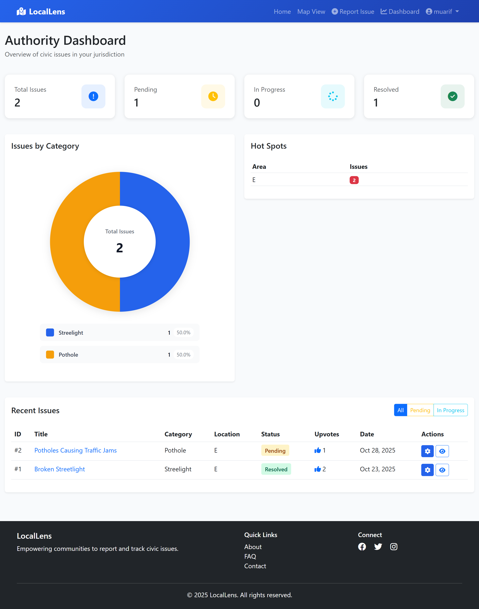

### Manage Issue
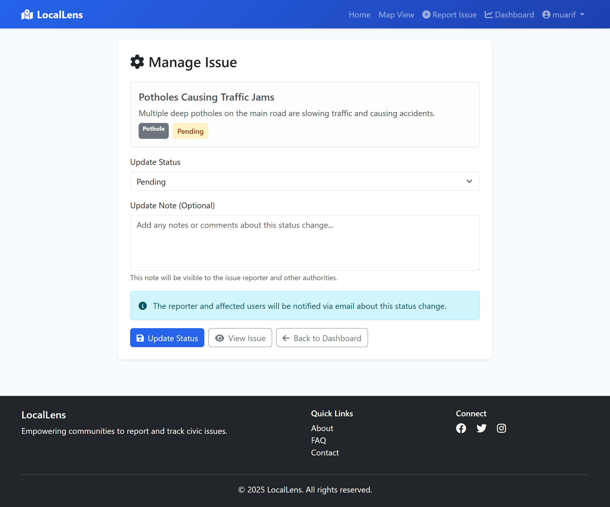

## Features

- **Issue Reporting**: Citizens can report local issues with geolocation, images, and detailed descriptions
- **Interactive Map**: Visualize all reported issues on an interactive map with filtering capabilities
- **Privacy Controls**: Choose between public visibility or authorities-only access
- **Community Engagement**: Upvote issues and mark yourself as affected to show support
- **Real-time Updates**: Track issue status from pending to resolved
- **Comments & Discussion**: Engage in conversations about reported issues
- **User Dashboard**: Manage your reported issues and track activity
- **Notification System**: Stay informed about updates to issues you care about
- **REST API**: Programmatic access to issue data for integrations

## Technology Stack

- **Backend**: Django 4.x with GeoDjango
- **Database**: PostgreSQL with PostGIS extension
- **Mapping**: Leaflet.js for interactive maps
- **Task Queue**: Celery with Redis
- **Cache**: Redis
- **API**: Django REST Framework
- **Frontend**: Bootstrap 5 with Crispy Forms
- **Email**: SMTP configuration for notifications

## Prerequisites

- Python 3.8+
- PostgreSQL 12+ with PostGIS extension
- Redis (for Celery and caching)
- GDAL library (for geospatial operations)

## Installation

1. **Clone the repository**
   ```bash
   git clone https://github.com/yourusername/locallens.git
   cd locallens
   ```

2. **Create a virtual environment**
   ```bash
   python -m venv venv
   source venv/bin/activate  # On Windows: venv\Scripts\activate
   ```

3. **Install dependencies**
   ```bash
   pip install -r requirements.txt
   ```

4. **Set up environment variables**
   
   Create a `.env` file in the project root:
   ```env
   SECRET_KEY=your-secret-key-here
   DEBUG=True
   ALLOWED_HOSTS=localhost,127.0.0.1
   
   # Database
   DB_NAME=locallens_db
   DB_USER=postgres
   DB_PASSWORD=your-password
   DB_HOST=localhost
   DB_PORT=5432
   
   # Email
   EMAIL_HOST=smtp.gmail.com
   EMAIL_PORT=587
   EMAIL_HOST_USER=your-email@gmail.com
   EMAIL_HOST_PASSWORD=your-app-password
   DEFAULT_FROM_EMAIL=noreply@locallens.com
   
   # Redis & Celery
   CELERY_BROKER_URL=redis://localhost:6379/0
   CELERY_RESULT_BACKEND=redis://localhost:6379/0
   REDIS_URL=redis://127.0.0.1:6379/1
   
   # Site
   SITE_URL=http://localhost:8000
   SITE_NAME=LocalLens
   ```

5. **Set up PostgreSQL with PostGIS**
   ```sql
   CREATE DATABASE locallens_db;
   \c locallens_db
   CREATE EXTENSION postgis;
   ```

6. **Run migrations**
   ```bash
   python manage.py makemigrations
   python manage.py migrate
   ```

7. **Create a superuser**
   ```bash
   python manage.py createsuperuser
   ```

8. **Collect static files**
   ```bash
   python manage.py collectstatic
   ```

9. **Run the development server**
   ```bash
   python manage.py runserver
   ```

10. **Start Celery worker** (in a separate terminal)
    ```bash
    celery -A locallens worker -l info
    ```

## Usage

1. Visit `http://localhost:8000` to access the application
2. Register a new account or login with your superuser credentials
3. Report a new issue by clicking "Report Issue"
4. Browse issues on the map or in list view
5. Upvote issues and mark yourself as affected
6. Comment on issues to provide updates or additional information
7. Access the admin panel at `http://localhost:8000/admin`

## Project Structure

```
locallens/
├── issues/          # Core issue reporting functionality
├── users/           # User authentication and profiles
├── dashboard/       # User and authority dashboards
├── notifications/   # Notification system
├── templates/       # HTML templates
├── static/          # CSS, JS, images
├── media/           # User-uploaded files
├── logs/            # Application logs
└── locallens/       # Project settings
```

## API Endpoints

The REST API is available at `/api/`:

- `GET /api/issues/` - List all public issues
- `GET /api/issues/{id}/` - Get issue details
- `POST /api/issues/` - Create a new issue (authenticated)
- `PUT /api/issues/{id}/` - Update an issue (authenticated)
- `DELETE /api/issues/{id}/` - Delete an issue (authenticated)

API authentication uses session-based or basic authentication.

## License

This project is licensed under the MIT License - see the LICENSE file for details.

## Support

For issues, questions, or contributions, please open an issue on GitHub or contact the maintainers.

## Acknowledgments

- Built with Django and GeoDjango
- Map tiles from OpenStreetMap
- Icons from Bootstrap Icons